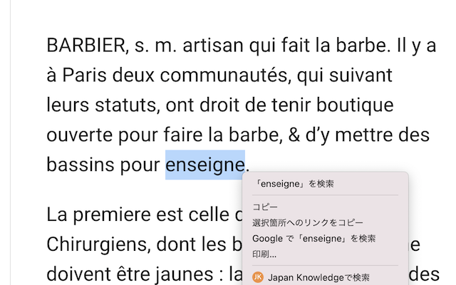

## 概要

ジャパンナレッジで検索を行う Chrome 拡張機能を公開しました。

以下のように、選択した文字列をクエリとして、右クリックからジャパンナレッジの検索結果を表示します。

本記事では、この拡張機能の使い方について説明します。

## インストール

以下のページにアクセスして、「Chrome に追加」ボタンをクリックしてください。

https://chrome.google.com/webstore/detail/japan-knowledge-%E6%A4%9C%E7%B4%A2/doidhbpgbhfomddehalamilioomokefl

## 設定

以下の URL を Chrome のアドレスバーに入力し、検索条件の設定を行います。入力項目として、「URL」と「その他のクエリ」の 2 種類があります。

chrome-extension://cppjkneekbjaeellbfkmgnhonkkjfpdn/options.html

### URL

検索で使用するジャパンナレッジの URL を指定します。ご自身の環境や契約内容に応じて設定してください。「JK Lib」「JK Personal」ボタンをクリックすると、それぞれの URL が入力されます。

また、例えば東京大学では EZproxy を使い、学外から以下の URL でジャパンナレッジにアクセスすることができます。このような場合は、URL を直接入力してください。

https://japanknowledge-com.utokyo.idm.oclc.org/lib

### その他のクエリ

この項目では、検索文字列（q1）以外のクエリパラメータを入力します。例えば、「ロベール仏和大辞典」のボタンをクリックすると、当該コンテンツ（cids=42200）に検索対象を限定するクエリパラメータが入力されます。

その他の検索条件の指定方法については、ジャパンナレッジの検索結果の URL 等を参考にしてください。

## 検索

検索したい文字列を選択し、右クリックを行うことで、「ジャパンナレッジで XXX を検索」のメニューが表示されますので、そちらをクリックして検索してください。

## まとめ

ジャパンナレッジを利用する際の参考になれば幸いです。

## ソースコード

ソースコードは以下でご確認いただけます。

https://github.com/nakamura196/jk_search
